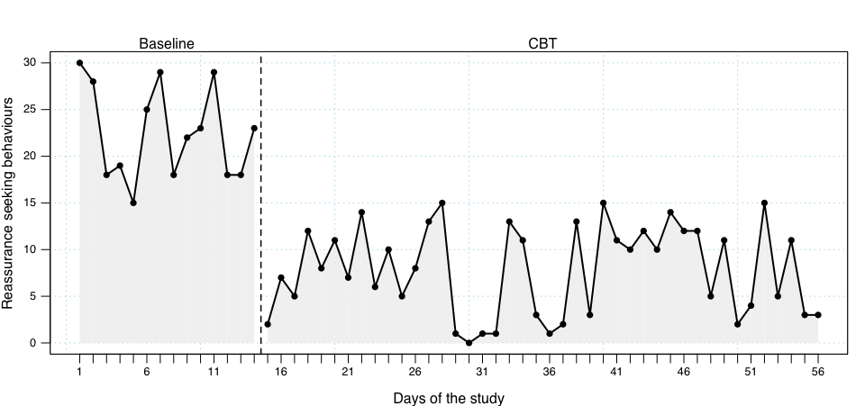
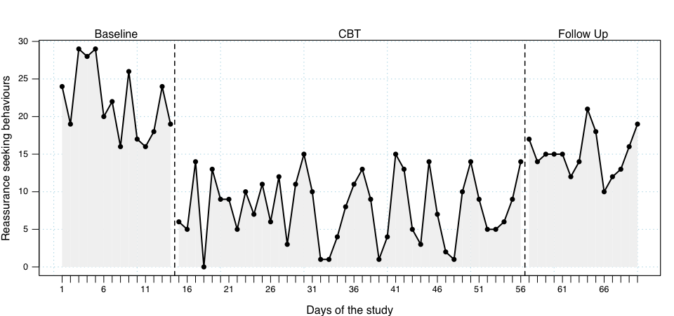
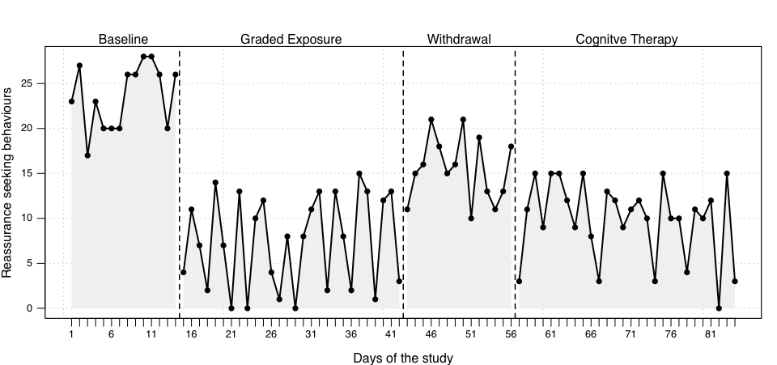
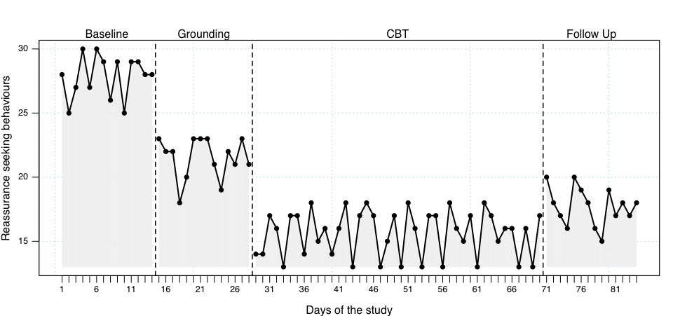

```{r setup, include=FALSE}
options(htmltools.dir.version = FALSE)

library(xaringan)
library(xaringanExtra)
library(dplyr)
library(gganimate)
library(ggExtra)
library(xaringanthemer)
library(RColorBrewer)
library(vembedr)

xaringanExtra::use_editable()
xaringanExtra::use_panelset()
xaringanExtra::use_freezeframe()
xaringanExtra::use_webcam()
xaringanExtra::use_fit_screen()
xaringanExtra::use_progress_bar(color = "red", location = "top")
xaringanExtra::use_tile_view()
xaringanExtra::use_scribble()
#xaringanExtra::use_search(show_icon = T, auto_search = F, position = "")
xaringanExtra::use_logo(image_url = "https://raw.githubusercontent.com/rstudio/hex-stickers/master/PNG/xaringan.png")
xaringanExtra::use_share_again()

```
class: center, middle, split-three, about-me-slide
background-image: url(uos.png), url(pearls.jpg)
background-position:5% 95%, 98% 96%
background-size: 110px 50px, 10%

.column.bg-main1[.content[


### Steve Kellett

#### Clinical Psychologist

.fade[Sheffied Health & Social Care
NHS Foundation Trust]

[`r icons::icon_style(icons::fontawesome("envelope"), scale = 1.5)`](mailto:s.kellett@sheffield.ac.uk)
[`r icons::icon_style(icons::fontawesome("researchgate"), scale = 1.5)`](https://www.researchgate.net/profile/Stephen-Kellett)
]]
.column.bg-main2[.content[


### Mel Simmonds-Buckley

#### Researcher

.fade[University of Sheffield]

[`r icons::icon_style(icons::fontawesome("envelope"), scale = 1.5)`](mailto:m.simmonds-buckley@sheffield.ac.uk)
[`r icons::icon_style(icons::fontawesome("graduation-cap"), scale = 1.5)`](https://scholar.google.com/citations?user=T85W7TYAAAAJ&hl=en)
[`r icons::icon_style(icons::fontawesome("researchgate"), scale = 1.5)`](https://www.researchgate.net/profile/Mel-Simmonds-Buckley)
]]
.column.bg-main3[.content[


### Chris Gaskell

#### Clinical Psychologist

.fade[Salford Royal
NHS Foundation Trust]

[`r icons::icon_style(icons::fontawesome("twitter"), scale = 1.5)` ](https://twitter.com/chrisgaskell92)
[`r icons::icon_style(icons::fontawesome("github"), scale = 1.5)`](https://github.com/chris-gaskell)
[`r icons::icon_style(icons::fontawesome("envelope"), scale = 1.5)`](mailto:chris-gaskell@hotmail.co.uks)
[`r icons::icon_style(icons::fontawesome("graduation-cap"), scale = 1.5)`](https://scholar.google.com/citations?user=gQuNwfYAAAAJ&hl=en&authuser=1&oi=ao)
[`r icons::icon_style(icons::fontawesome("researchgate"), scale = 1.5)`](https://www.researchgate.net/profile/Chris-Gaskell-2)
]]

---
class: center, top, split-three, inverse
background-image: url(https://rin.org.uk/resource/resmgr/nav21/nav21_map.png)
background-position:8% 70%
background-size: 375px 300px


.column.bg-main1[.content[.right[


# `r icons::icon_style(icons::fontawesome("compass"), scale = 1, fill = "var(--my-yellow)")` Navigating these slides

]]]


.column.bg-main2[.content[


.Large[.bold[
### Day 1
[Aims + Intro](#aims-slide)

[Why](#why-slide)

[Measures](#measures-slide)

[Designs](#designs-slide)

[Setting it up](#stages-slide)]
]]]

--

.column.bg-main3[.content[


.Large[.Bold[
### Day 2

.bold[
Analysis

Practice

<a href="https://sced-for-clinicians.netlify.app/resources/"> Resources </a>
]

]]]]

--

.footnote[.Large[**Note**: Underlined
.white[.underline[white]] and
.my-hot-white[.my-blue[.underline[blue]]] text are hyperlinks!]
]

---

name: contents-slide
class: inverse
background-image:
background-position:
background-size:

# `r icons::icon_style(icons::fontawesome("compass"), scale = 1, fill = "var(--my-yellow)")` Navigating these slides

`r icons::icon_style(icons::fontawesome("keyboard"), scale = 1, fill = "var(--my-yellow)")`
.large[.white[Keyoard shortcuts] - Press 'h'.]

`r icons::icon_style(icons::fontawesome("map-marked-alt"), scale = 1, fill = "var(--my-yellow)")`
.large[.white[Overview slides] - Press 'o'.]

`r icons::icon_style(icons::fontawesome("pen"), scale = 1, fill = "var(--my-yellow)")`
.large[.white[Scribble on slides] - Press 's'.]

--

.footnote[
.pull-left[
.Large[`r icons::icon_style(icons::fontawesome("file-pdf"), scale = 1, fill = "var(--my-yellow)")`]
This presentation is available as a <a href="https://chris-gaskell.github.io/uos-sced/day-one/output/day-one.pdf">pdf</a> and <a href="https://chris-gaskell.github.io/uos-sced/day-one/output/day-one.pptx">powerpoint</a>


.Large[`r icons::icon_style(icons::fontawesome("envelope"), scale = 1, fill = "var(--my-yellow)")`]
If you find any problems with these slides then e-mail
<a href="mailto:cgaskell1@sheffield.ac.uk">Chris</a>.
]]

--
.pull-right[
.center[
<figure>
  
  
    
  <figcaption>.small[.right[Slides made using Xaringan and R Markdown.]]</figcaption>
</figure>

]]


---
layout: true
background-image: url(uos.png), url(pearls.jpg)
background-position:5% 95%, 98% 96%
background-size: 110px 50px, 10%
---
name: aims-slide

#  Aims of the workshop

.large[
+ Become .blue[familiar] with the requirements of single case design.
+ Appreciate the links between .blue[practice-based evidence] and SCED methodology.
+ .blue[Understand] the basic features of the SCED designs.
+ Consider ways of engaging clients in SCED.
+ Appreciate the .blue[potential] of SCED methodology.
]

---
layout: true
background-image: url(uos.png), url(pearls.jpg)
background-position:5% 95%, 98% 96%
background-size: 110px 50px, 10%
---
#  Aims of the workshop

.large[
+ .blue[Review the application] of SCED methodology within clinical research and practice.
+ Consider potential .blue[practical difficulties] in implementation of SCED.
+ Provide .blue[practical experience] of design and analysis.
+ Foresee potential difficulties and .blue[trouble-shoot].
]

---
layout: false
class: inverse2, top, center

# Discussion Task

.left[
## **Is change important?**

.large[Q. To what extent is change important?]

.large[Q. How can we demonstrate if change has occurred?]

.large[Q. Should we measure change? why?]

.large[Q. What is our relationship to measuring change?]]

.footnote[
.large[*10 minute discussion task in pairs]
]

---
exclude: true
#  Hopes for the workshop

## Include `r icons::icon_style(icons::fontawesome("pen"), scale = 0.8, fill = "grey")`
.can-edit.key-firstSlideTitleunique[
- Write 
- Here
- And
- We
- Will
- Come
- Back
]

---
#  A note on the assignment

.pull-left[
+ Conduct a SCED of psychological treatment.
+ Any design is permissible (we will teach you all the methods). 

We are going to give you everything you need in order to be able to pass your assignment.]


.pull-right[
]

---
layout: false
class: inverse, middle, center
# Introduction to SCED

---
layout: true
name:aims-slide
background-image: url(uos.png), url(pearls.jpg)
background-position:5% 95%, 98% 96%
background-size: 110px 50px, 10%

---
exclude: true
# Brief history slide

---
background-image: url(images/plot.png)
background-position:50% 95%
background-size: 70% 30%

#  Single case involves: 

--

+ .blue[Scientific] approach to monitoring change/response to a given treatment.

--

+ .blue[Time-series] measurement (quantifiable + over time).

--

+ .blue[Baseline] period.

--

+ .blue[Experimental manipulation] of an IV.

???

+ (i.e., introduce/remove/change treatment).
+ Experimental = 3+ manipulations
+ Less than this = quasi experimental.

--

+ Focus on .blue[within-subject] variability.

---

#  What is a baseline? 

+ .blue[Repeated measurements] before treatment is introduced.

+ The ideal is .blue[long and stable] baselines.

--

.pull-left[
.red[However:]
+ Not common 
+ Some disorders have inbuilt variability.
+ Are neutral baselines a fallacy?
]


.pull-right[

]

---

#  The focus? 

.large[
- Your .blue[individual] service user.

- .blue[You], the clinician.

- Why and what leads to change?

- Within client change rather than across client change.]

---
name: why-slide
class: inverse, middle, center
layout: false

# Why use SCEDs? 

---
layout: true
background-image: url(uos.png), url(pearls.jpg)
background-position:5% 95%, 98% 96%
background-size: 110px 50px, 10%
---

#  So why use SCEDs? 

--

.large[.red[`r icons::icon_style(icons::fontawesome("microscope"), scale = 1, fill = "var(--my-blue)")` **Clinical research:**] Testing clinical hypotheses and contributing to knowledge.]

--

.large[.blue[`r icons::icon_style(icons::fontawesome("vial"), scale = 1, fill = "var(--my-blue)")` **Practice philosophy**:] Being a scientist practitioner.]

--

.large[.orange[`r icons::icon_style(icons::fontawesome("balance-scale"), scale = 1, fill = "var(--my-blue)")` **Accountability and evaluation:**] Being a effective practitioner and auditing your work.]

--

.large[.pink[`r icons::icon_style(icons::fontawesome("book-open"), scale = 1, fill = "var(--my-blue)")` **Education and training:**] Learning SCED skills for the rest of your career]

---
# Status of SCED as a research tool? 

.pull-left-narrow[

]

.pull-right-wide[
+ Highly .blue[accessible] for clinicians.
+ Growing .blue[popularity].
  + Single case texts/books regularly published.
  + No longer restricted to ABA.
  + Health user movements.
+ Appropriate for novel or .blue[emerging] areas.
  + e.g. CBT and panic/psychosis rooted in SCED evidence.
  + RCTs are not the only option.
+ Rapidly developing field.
  + New analytical methods + designs.]


---
background-image: url(https://johnlewis.scene7.com/is/image/JohnLewis/237518072)
background-position: -20% 30%
background-size: 600px 600px

.pull-right-wide[
# Hour Glass Model

Three stage research cycle for evidencing treatment (Salkovskis, 1995):
1. Practice based pilot studies on small *n* in routine services.
2. Highly controlled trials efficacy studies (e.g. RCTs).
3. Implementation studies (return treatment to routine settings.)

.center[

<figcaption class="caption">Figure taken from interesting
<a href="https://bpspsychub.onlinelibrary.wiley.com/doi/pdfdirect/10.1111/papt.12278">BABCP article</a>
</figcaption>

]

]


---
background-image: url(https://www.its.ws/PublishingImages/Quality/Quality-data.jpg)
background-position:100% 65%
background-size: 45% 65%
#  Clinical Practice

.pull-left[
+ Accountability and evaluation.
+ Demonstrating treatment effectiveness.
+ Monitoring progress (or deterioration).
+ Training in single case methods makes more effective practitioners?
+ Referral on following ineffective treatment – you will really know this.
+ Inviting patient to be part of evaluation.
]

---
background-image: url(https://images.unsplash.com/photo-1588600878108-578307a3cc9d?ixid=MnwxMjA3fDB8MHxzZWFyY2h8MTR8fHJlc2VhcmNofGVufDB8fDB8fA%3D%3D&ixlib=rb-1.2.1&auto=format&fit=crop&w=500&q=60)
background-position:85% 85%
background-size: cover
class: center, bottom

##  .my-yellow[.my-hot-blue[Being a Scientific Practitioner]]

---

# Scientific Practitioner

.left[
Most useful contribution of SCED?

Ability to answer questions that are .red[clinically relevant variants on those of evidence-based practice.]]

--

.pull-left[
<figure class="quote">
  <blockquote>
  .blue[
  .large[
    “Does this evidence-based treatment work for this particular client, who differs in some way from the sample characteristics of the evidence base?".]]
  <figcaption>
</figure>
]

---
#  What’s the advantage of SCED? 

.pull-left[
.large[
- Low cost

-  Low infrastructure

- Small ‘turning circle’

- Easily adaptable + flexible

- Collaborative (if done right)
]]
--

.pull-right[
.Large[.white[.my-hot-blue[**Available for all clinicians to use!**]]].
]

---
#  Why don’t clinicians use it? 
.large[
+ Lack of confidence

+ Lack of knowledge

+ Can be messy in practice - The ideal described in the classic texts on the design seems a far cry from what is possible in the real world.
  
+ Perception that it is too much for the recipient to handle - <a href="http://www.dgapractice.com/documents/meehl_case_conferences_adapted.pdf">Theory of Spun Glass</a> (Meehl, 1973)
]

---
name: measures-slide
class: center, middle
background-image: url(https://images.unsplash.com/photo-1501516069922-a9982bd6f3bd?ixid=MnwxMjA3fDB8MHxzZWFyY2h8MXx8bWVhc3VyZXxlbnwwfHwwfHw%3D&ixlib=rb-1.2.1&auto=format&fit=crop&w=500&q=60)
background-position:85% 85%
background-size: cover


#  .my-yellow[.my-hot-blue[Approaches to Measurement]]


---
class: center, top, split-three,


.column.bg-main1[.content[


### Nomothetic Measures

.fade[Traditional questionnaire approaches used in services.]
]

.my-hot-pink[ 
- Attempts to generalise people.
- Uses objective knowledge.
- Based on data that is categorical or numerical.
]
]

--

.column.bg-main2[.content[


### Idiographic Measures

.fade[Unique measures applied in an individualised manner.]
]
.my-hot-green[
- Focuses on recognition of uniqueness.
- Uses subjective experience.
- Based on study of uniqueness at an individual level.
]
]

--

.column.bg-main3[.content[


### Qualitative Approaches

.fade[Qualitative approaches to assessment (e.g. interviews).]]
.my-hot-red[
- like ideographics, focuses on subjective judgement and experience. 
- Traditional methods: interviews, focus groups, soft outcomes.
]
]

.footnote[.center[
<a href="https://i.ytimg.com/vi/eiCSJL5zOng/maxresdefault.jpg">Adapted from </a>
]]
---

#  Ideographic or nomothetic?

<p>SCED seeks to balance focus on nomothetic and idiographic approaches to measurement.</p>

A funnel approach from nomothetic to idiographic target measures

--

<figure class="quote">
  <blockquote>.blue[
    “Different but complementary approaches to accumulating a broader base of evidence... So, when asked by clinical trainees, what two outcome measures I would recommend, my response invariably is: one nomothetic and one idiographic".]
  <figcaption>
    &mdash; Barkham, 2016</cite>  </figcaption>
</figure>

--

<p>Nomothetic and ideographic has long tradition within psychotherapy Sheffield University (e.g., Barkham, Stiles, & Shapiro, 1993).</p>


.center[
<a href="https://eprints.whiterose.ac.uk/104190/1/Commentary%20on%20Alves%20and%20Sales%20final%20version.pdf"> Barkham commentary (2017) </a>
]


---

https://dclinpsych.leeds.ac.uk/wp-content/uploads/sites/26/2019/03/Gary-Latchford-idiographic-day.pdf

#  Time series measurement 

+ .blue[Frequent and systematic measurement] of outcome measures that are key to the maintenance of the clinical problem
+ In essence, you then ask to what extent the observed variation in the measures is consistent with change occurring?
+ The repeated measures provide data on the variation across time in these outcome. With this information the search can begin for the causes of that variation


.center[

]
---
#  Using nomothetic measures  

+ These are the questionnaires that are 'off the shelf' and often used for pre-post change.
+ Use them:
  + at the start/end of each phase.
  + at the end of follow-up (if you have that in your design).
+ Try to match one the nomothetic measure to the presenting problem
+ Is the measure you are using one of .blue[Effectiveness]
  + General psychological distress (e.g. CORE-OM, SCL-90, BSI, OQ-45, K-10).
  + Disorder specific (e.g. BDI, PHQ-9, GAD-7, YBOCS, IES).
+ Supplement with other measures?
  + Process?
  + Clinician rated?
  
---

#  Generalisation measures

Whilst the intervention should influence the target of the intervention, an important issue is whether the intervention generalizes to other aspects of the client’s life.

These measures are good test of the external validity of your work.

You take these measures (e.g. quality of life) occasionally and often in tandem with the nomothetic outcomes measures.

- Functioning (e.g. WSAS).
- Health related quality of life
- Life satisfaction


---

# Qualitative approaches

Qualitative approaches can also be profitably applied to the single-case design. The collection of rich, detailed qualitative information throughout the course of treatment can prove useful in helping to rule out alternative hypotheses

---
background-image: url(https://i.imgflip.com/n7kko.jpg)
background-position:95% 65%
background-size: contain
class: inverse

# .my-hot-blue[Setting up ideographic measures]

---

#  Designing idiographic measures: Steps

.large[
Step 1) Agree upon the .blue[constructs] that need to change (e.g., compulsive checking).

Step 2) Agree upon the .blue[scale of measurement] (e.g., checking frequency).

Step 3) Agree how the information is going to be .blue[recorded] (e.g., daily diary self-report).
]

---

#  1. Constructs - What to measure?

.large[
- .blue[Anything!] (that matters to the patient).
- From the start of the first appointment keep your eyes peeled.
- Don't be afraid to offer suggestions or recommendations.
- Could be a cognition, behaviour, affect or interpersonal process.
- What does the patient, the family, the referrer want?
- Miracle Question...?
]

Design it collaboratively with your patient.

Explain the reason why.

---

#  2. Measurement scales

.large[
.blue[Frequency] = Count data (e.g., number of checking behaviours).

.blue[Intensity] = Quantifying severity (e.g., 1-10, high-medium-low).

.blue[Duration] = Time (e.g., number of hours)

.blue[Event Occurrence] = Binary event occurrence (did something happen or not)
]

+ The scale can influence the analyses available. Event occurance is more supplementary.
+ Anchored and scaled effectively – let the client define this.

---
#  3. How to record

.large[
.blue[When to measure]: Daily? More? Less?

.blue[Who measures]: Patient? Relative? Carer? Staff?

.blue[Recording tool]: Pen and Paper? Template? Excel file? Smart phone? MS Forms?
]

For an example of a MS tool click <a href="https://chris-gaskell.github.io/uos-sced/day-one/idiographic-diary.xlsx">here</a>

---
#  Baseline requirements

How long should the baseline be? Varies by discipline.

Some argue that there should be stability (5% variability around mean) before progressing to intervention however this is not always essential (or realistic).

When does the baseline end? (should be at a defined, planned point). A good place may be when providing the formulation (if using one).

**Remember**! Your idiographic measures go from the start to end of the work.

---
#  Baseline trends

+ A worsening baseline (worsening of symptoms) may represent a temporary change that would dissipate regardless of any intervention.
+ An improving baseline may prevent confidence in saying whether subsequent improvement is due to intervention or natrual remission.
+ Stability also shows its not spontaneous recovery

.blue[Ideally] the baseline should be stable (mean level) with low variability.
Problems arise if baselines display:
( i )	Linear trends:
(ii)	Higher order trends
(iii)	High variability.
Presence of these makes visual or statistical analysis more difficult **(but still possible)**.

---
# Control measure 

+ These are an idiographic measure, not expected to change due to the intervention
+ If there is change in the target idiographic measures and not the control is shows the intervention working.
+ Assessing specificity of effect on target measures. 

---
#  How to engage clients 

+ Not a must do aspect of your work
+ Provide the rationale
+ Have a relaxed attitude
+ Display interest in their plight
+ Be flexible
+ This is an aspect of your normal practice
+ Promise feedback

---
layout: false
class: inverse2, top, center

# Practice setting up measures

.left[.Large[
Modelling / role play

What the demonstration then critique

Practice in pairs
]]
---
name: designs-slide
class: inverse, middle, center

# Designs

---
layout: false
class: inverse

.panelset[

.panel[.panel-name[Designs] <!--Front-->

.small[.pull-left-narrow[.white[Numerous SCED designs]
- A = Baseline
- B = Intervention
- A2/W = Withdrawal
- C = Alt. treatment
- FU = Follow up

Important to consider ethics and feasibility.

Design influences strength of validity.
]]

.pull-right-wide[
]
] 

.panel[.panel-name[A-B] <!--AB-->

.small[
.pull-left-narrow[
- Most basic & accessible.
- Improvement on simple pre-post
- Low validity.
- Quasi-experimental.
- Leaves open many alternative explanations for observed change.
]]

.pull-right-wide[
### .center[Classic A-B Design]

.center[

]
]

.right[
.small[For examples of studies using AB designs see
<a href="https://www.cambridge.org/core/services/aop-cambridge-core/content/view/F4ED9F2DD6363B66B0C18F6B4A3081B6/S1352465814000411a.pdf/transdiagnostic-cbt-treatment-of-co-morbid-anxiety-and-depression-in-an-older-adult-single-case-experimental-design.pdf">(Hague, 2015)</a> or 
<a href="https://eprints.whiterose.ac.uk/174906/3/Effectiveness%20of%20the%20unified%20protocol%20for%20treating%20co-morbid%20health%20anxiety%20and%20depression%20-%20an%20empirical%20case%20study.pdf">(Gaskell, 2021)</a>.
]]


] <!--A-B-FU Design-->

.panel[.panel-name[A-B-FU]

.pull-left-narrow[
.small[
- Multiple comparisons possible.
- Can assess maintenance of gains.
- stronger than A-B design.
]]

.pull-right-wide[
### .center[Integrating a follow-up]

.center[

]
]

.right[
.small[For an example study using an AB follow up design see
<a href="https://www.tandfonline.com/doi/pdf/10.1080/03069885.2021.1929834">(Kellett, 2021)</a>.
]]

] <!--A-B-FU Design-->

.panel[.panel-name[A-B-A-B]

.pull-left-narrow[
.small[
- Are the effects of the intervention durable?
- What happens if the treatment is withdrawn?
]]

.pull-right-wide[
### .center[Using a withdrawal phase]

.center[

]
]

.right[
.small[For an example study using an ABAB design see
<a href="https://bpspsychub.onlinelibrary.wiley.com/doi/pdfdirect/10.1111/papt.12278">(Kellett, 2021)</a>.
]]

] <!--A-B-A-C-->

.panel[.panel-name[A-B-A-C]
.pull-left-narrow[
.small[
- Comparing treatment effectiveness.
– Seldom employed in psychotherapy .
]]

.pull-right-wide[
### .center[Alternating the treatment]
.center[

]]

.right[.small[For an example study using an ABC design see <a href="https://www.cambridge.org/core/services/aop-cambridge-core/content/view/2997836636C01A6766138701F889AB8C/S1352465820000521a.pdf/treatment_of_compulsive_buying_disorder_comparing_the_effectiveness_of_cognitive_behavioural_therapy_with_personcentred_experiential_counselling.pdf">(Kellett, 2021)</a>.]]
]
] <!--Panel-Set-End-->

---

# Considerations with withdrawal designs

Ask yourself "am I being ethical and so are reversals or withdrawals appropriate?". Important to know the methodological features before you start (see the later planning slide)

.pull-left[
###  Theoretical consdiderations
.small[
+ Are treatments reversible?
+ Carry-over effects.
+ Therapeutic instructions (e.g. self-control / management strategies)
+ long-acting pharmacological interventions;
+ altered environments & staff attitudes.
]]

.pull-right[
###  Ethical considerations 
.small[
+ Prior agreement with client/staff needed, along with consent.
+ Brief withdrawal phase and rapid re-instatement of treatment
+ Client's expectations and adherence to withdrawal
+ Treatment holidays?
]]
---

#  Threats to validity

1.	History (extraneous concurrent events)
2.	Maturation (spontaneous recovery)
3.	Testing (reactivity and the mere measurement effect)
4.	Instrumentation (reliability)
5.	Multiple intervention problems (can a psychotherapy be withdrawn)?
6.	Instability

---

#  Multi-component interventions

+ Borkovec and Castonguay (2006) point out, the use of mini-interventions in which circumscribed components of treatment are actively manipulated is an underused research strategy, but one that offers the opportunity to increase our knowledge of basic change mechanisms in psychological treatments.
+ Separate out the modules on the time series graphs and test for an effect.

For assignment submit the excel sheets as part of the submission showing each module and the scores on the idiographic measures during the phases

---
#  Planning your design

+ Start planning and designing from the referral letter.
+ Write a plan and take it to supervision

Things to consider:
+ The type of design
+ The number of sessions in each phase and module
+ How the phases will be sequenced with the modules
+ Frequency of the idiographic measures
+ Frequency of the nomothetic and generalisation measures
+ Frequency, duration, place and time of sessions
+ Baseline fidelity (be able to describe in full detail)
+ Treatment fidelity (how to keep everything the same bar starting treatment).

---
name: stages-slide
class: inverse, middle, center

#  Stages of SCED  

---
class: inverse, center, top

# The stages of a SCED
.left[.large[.white[
1. Identify question and hypothesis.

2. Select appropriate design and measures.

3. identify materials and resources.

4. Collect data/supervise study.

5. Analysis .small[(covered in day 2)]

6. Interpretation.

7. Communication/dissemintation.
]]
.footnote[These stages may need to be considered collectively and not in isolation.  For example. The level of communication of findings may determine the level of analysis adopted.]]

---
#  Identify clinical question and hypotheses

Hypotheses can be developed as soon as you have any sense of what the subject of change could be (referral letter? Clinical notes? First session?).

**Considerations**:
- How do the hypotheses fit the psychological formulation?
- Are there any treatment textbooks that are going to be important?
- Is the clinical problem compatible with the therapy as described in the treatment manual?
- State the hypotheses clearly!
- State any therapeutic predictions clearly!

.blue[Example:] That CBT will lead to a reduction in 'hurting myself' (idiographic) as measured daily, and also a reduction in overall depression as measured through the PHQ-9 (nomothetic).  

---
#  Identify measures

- What measures are required to assess the therapeutic aims and goals?
- Nomothetic before/after each phase?
- Idiographics daily throughout?

Ensure measures are suitable for SCED. In practice this usually means:
- Observational measures such as time sampling and staff checklists on in-patient ward
- daily diaries of symptoms, functioning, problem resolution
- Regular use of short psychometric questionnaires etc.
- Ensure rating scales are unambiguously worded and are anchored and well described.

---

#  Identify measures 

- Ensure that diaries are well laid out and well presented.
- Scraps of paper do not value people and are seldom completed!
- 1 page per day? per week? per month?
- Consider using a combination of measures targeted at both symptoms and functioning.
- Consider several sources of measurements: client and partner/carer, child and parent,
- Consider use of follow ups phase; A/B-FU design

---
#  Materials & Resources

Ensure measures are acceptable/appropriate for client, or staff or carer or partner.

Plan for study to be feasibly matched to realities of NHS clinical practice:
- baseline collected across sessions 1-2?
- Intervention starts session 3, 16 sessions of therapy contracted
- follow ups at 6 weeks and 6 months?

Ensure quality of adequate resources

Staff need to be properly briefed:
- Patients need to know what they need to do.
- Supervisor aware of coursework.
- Any involved staff on wards are briefed.

---
#  Materials & Resources

If staff are collecting the data do they understand the design rationale and do they need any training?

Data should be recorded and stored reliably (i.e. it is being written down in a retrievable manner, it is not missing and is confidential).

If appropriate, staff should receive ongoing feedback about progress of the case (i.e. regular review meetings) and this be reported in the method.

What are the consequences of diverting resources to this project in relation to other ongoing clinical work?

Is it feasible in the setting your working in?

---
#  Interpretation	 

- What are the main changes or effects?
- How do they correspond to predictions?
- Are they valid given the design?
- What alternative explanations (i.e. threats to validity) are there?
- Are the effects reliable or clinical significant? Are they noticeable to therapist, client or others?
- Are they generalizable or clinically replicable?
- If effects are clinically nonsignificant - what explanations exist?

---
#  Communication and dissemination

.Large[
- Share the findings with the client and/or the staff member.

- Thank client and staff.

There are robust research findings demonstrating that...

Feeding back outcomes to patients during treatment leads to greater outcomes.

**Particularly** for patients who are not on track.

]


---
#  Conclusions 

- SCED can be used in a wide variety of situations and these range across service users and settings.
- As trainee scientist-practitioners – a good place to be.
- Integrate the methods into your practice – don’t be anxious.
- Always start with the baseline - the design can evolve and be flexible
- This is still all about your client. Your job is to help them, not t merely manipulate variables and phases.
- Play around with the methodology

---
class: inverse, middle, center
#  End of Day one


```{r output, include=F, echo=F}
#xaringanBuilder::build_pptx("index.Rmd",
#        complex_slides = T, partial_slides = F)
```
