```{r setup, include=FALSE}
options(htmltools.dir.version = FALSE)

library(xaringan)
library(xaringanExtra)
library(dplyr)
library(gganimate)
library(ggExtra)
library(xaringanthemer)
library(RColorBrewer)
library(vembedr)

xaringanExtra::use_editable()
xaringanExtra::use_panelset()
xaringanExtra::use_freezeframe()
xaringanExtra::use_webcam()
xaringanExtra::use_fit_screen()
xaringanExtra::use_progress_bar(color = "red", location = "top")
xaringanExtra::use_tile_view()
xaringanExtra::use_scribble()
#xaringanExtra::use_search(show_icon = T, auto_search = F, position = "")
xaringanExtra::use_logo(image_url = "https://raw.githubusercontent.com/rstudio/hex-stickers/master/PNG/xaringan.png")

```
class: center, middle, split-three, about-me-slide
background-image: url(uos.png), url(pearls.jpg)
background-position:5% 95%, 98% 96%
background-size: 110px 50px, 10%

---
#  Plan for Day 2 

+ Visual analysis and interpretation
+ Statistical analysis and caveats
+ Assessing nomothetic outcomes
+ How it fits with your assignment
+ SCED analysis software and resources
+ Practical exercise: Have a go at some analysis!

---
#  Key features of SCED analysis 

+ SCEDs are fundamentally different to group-based research
	+ Group research -> averages/combined findings/overall effects
	+ SCED -> raw data/stability, variability, trends/individual effects
+ Visual analysis – this is the main analysis!
	+ Plot and analyse time series data visually
+ Statistical analysis
	+ Use statistics to confirm visual analysis
	+ Never interpret SCED statistics in isolation – viewed alongside visual plots
	+ Be aware of the limitations of statistical analysis in SCED

---
#  Visual analysis 

+ Plot each idiographic measure in a time series graph
Time points along the horizontal X axis
Severity/score on vertical Y axis
Depict phases with vertical lines intersecting the X axis

---

#  Visual analysis 

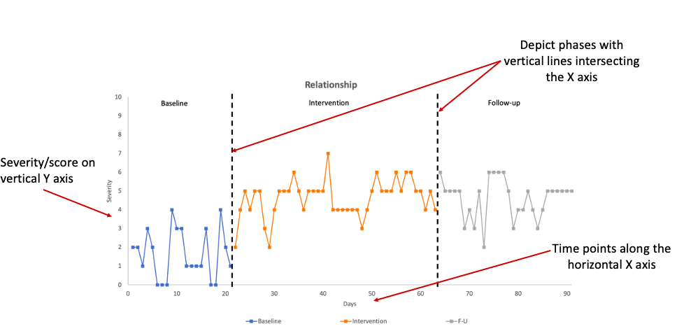
---

.panelset[

.panel[.panel-name[Visual] <!--Front-->

.small[.pull-left-narrow[Supplementing Visual Analysis]]

] 

Use visual aids to help with interpretation.

.panel[.panel-name[Central Tendency] <!--Central-Tendency-->

.small[
.pull-left-narrow[
Draw a horizontal line at the level of the measure of central tendency (e.g. median, mean) of data points in seperate phases.
]]

.pull-right-wide[
### .center[Central Tendency Lines.]

.center[
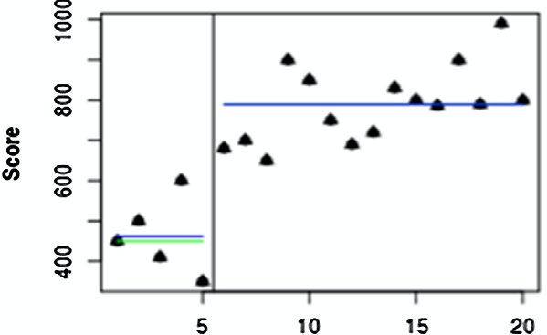
]
]

.right[
.small[For source and further information on effective visual plots see
<a href="https://pubmed.ncbi.nlm.nih.gov/29253607/">(Krasny-Pancini & Evans, 2018)</a>.
]]


] <!--Trend-Lines Design-->

.panel[.panel-name[Trend Lines]

.small[
.pull-left-narrow[
There are various methods for plotting trends:
- Split-middle trend line: Draw line connecting the median of each half phase.
- OLS regression trend line: Line drawn based on regression equation for each phase.
]]

.pull-right-wide[
### .center[Trend Lines.]

.center[
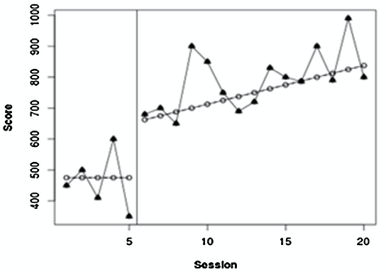
]
]

.right[
.small[For source and further information on effective visual plots see
<a href="https://pubmed.ncbi.nlm.nih.gov/29253607/">(Krasny-Pancini & Evans, 2018)</a>.
]]

] <!--Trend-Bands-->

.panel[.panel-name[Trend Bands]

.pull-left-narrow[
Suggested that trend lines only represent the data if 80% of the data points fall within envelope bands around the trend line.]

.pull-right-wide[
### .center[Trend Lne Stability Bands.]

.center[
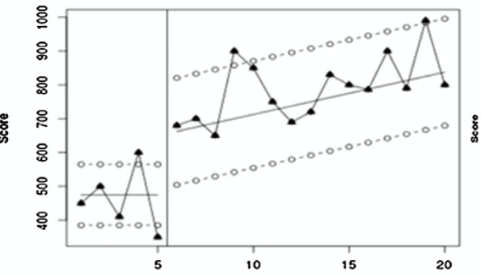
]
]

.right[
.small[For source and further information on effective visual plots see
<a href="https://pubmed.ncbi.nlm.nih.gov/29253607/">(Krasny-Pancini & Evans, 2018)</a>.
]]

] <!--Stability-Lines-->

.panel[.panel-name[Stability Lines]
.pull-left-narrow[
Calculate the mean and SD of each phase and then draw bands 2 SD above and below the mean. Expand the bands into the comparison phase.]

.pull-right-wide[
### .center[Stability Band Lines]
.center[
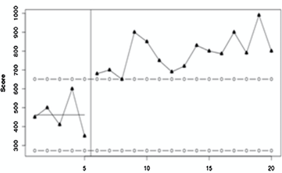
]]

.right[
.small[For source and further information on effective visual plots see
<a href="https://pubmed.ncbi.nlm.nih.gov/29253607/">(Krasny-Pancini & Evans, 2018)</a>.
]]
]

] <!--Panel-Set-End-->

---
#  Interpreting visual plots 

+ Interested in amount of overlap between data points in each phase
	+ Less overlap = more likely to be differences between phases i.e. an effect!
	+ Smaller variability within phases – easier to detect effects
Few overlapping data points between phases = intervention has had an effect
Lots of overlap between data points in the two phases – minimal effect of intervention

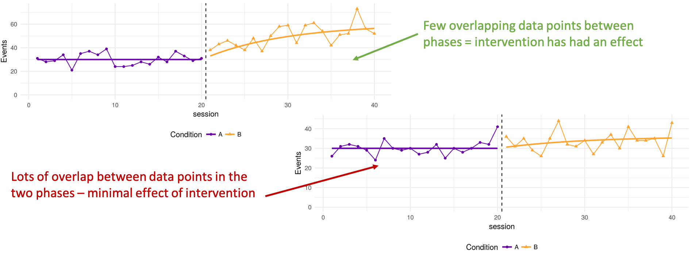

---
background-image: url(images/criteria.png)
background-size: contain

.footnote[
Cohen et al (2013) Single-Case Research Design in Pediatric Psychology: Considerations Regarding Data Analysis. Journal of Pediatric Psychology,  39, 124-127. 
]

---

#  Interpreting baseline trends

.pull-left-narrow[.small[
- Baseline may not be stable. Always need to interpret intervention phase in the contxt of baseline trend.
- Statistics allows us tto assess and adjust for baseline trends (more on Tau-U later)
]]


.pull-right-wide[
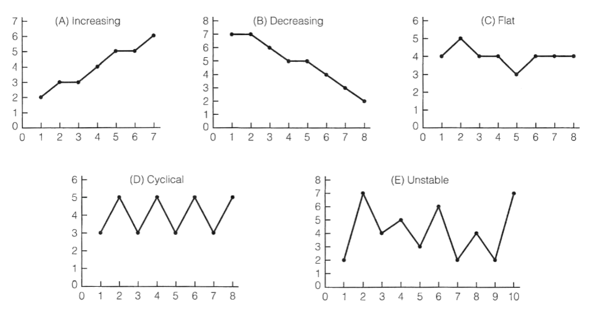
]

.footnote[Source: https://www.sjsu.edu/people/fred.prochaska/courses/ScWk240/s1/ScWk-240-Single-Case-Designs-Slides-Week-8.pdf]

---
background-image: url(images/base-trends-2.png)
background-size: cover

---
#  Statistical analysis
## Idiographic outcomes 

+ Visual interpretation can be subjective so accompanying statistical analysis can aid interpretation
However need to be aware;
+ Can be influenced by number of time points/length of baseline
+ Can be misleading if there is baseline trend
+ Often difficult to compare
+ No consensus on best statistical approach/effect size metrics
+ Statistically significant changes may not have clinical significance
+ Assumptions of many statistical tests are violated in time-series data (lack of independence caused by autocorrelation )

---
#  Why is autocorrelation a problem? 

+ Autocorrelation (also known as serial dependence) is the degree of similarity between one data point in a time series and a previous lagged time point i.e. how correlated are the data points
E.g. Weather is autocorrelated: the noon temperature on a Wednesday is predicted by what the noon temperature was on Tuesday, and to a lesser extent what the noon temperature was on Monday, or Sunday.
+ Time series data is often autocorrelated – a persons behaviour/thoughts/feelings are not random from day to day so the data is not strictly independent
	+ But most statistical tests are based on the assumption that data are independent
+ So when autocorrelation is present this assumption is violated and increases the risk of a Type 1 error (false positive)

---
#  SCED effect sizes
## Metrics for capturing between phase differences 

+ Nonparametric (overlap) and parametric (SMD, LOR etc.)
+ Historic, more commonly reported simple overlap statistics are highly criticised (e.g., PND)
+ More recently developed overlap effect sizes have improved (e.g. Tau)
+ Good practice to calculate more than one overlap metric
+ Remember they are relative to whether the desired direction of improvement is shown by an increase or decrease in the measure
	+ I.e., If desired outcome is increase , number of intervention data points that are higher than the baseline median
	+ If desired outcome is decrease , number of intervention data points that are lower than the baseline median

---
#  Non-overlap effect sizesComparing between phase differences 


```{r tbl77, echo = FALSE}
tbl77 <- tibble::tribble(
~`Common effect sizes`, ~`Description *(if an increase is the direction of improvement)`, ~`By hand`,
"Percentage exceeding the median (PEM)","Proportion of observations in phase B that improve upon the median of phase A. ","Yes",
"Percentage of non-overlapping data (PND)","*Proportion of observations in the B phase that exceed the highest observation from the A phase. Severe limitations as influenced by no. of time points in the baseline.","Yes",
"Percentage of all non-overlapping data (PAND)","*Proportion of observations remaining after removing the fewest possible number of observations from either phase so that the highest remaining point from the baseline phase is less than the lowest remaining point from the treatment phase.","Yes",
"Nonoverlap of all pairs (NAP)","*Proportion of all pair-wise comparisons where the treatment phase observation exceeds the baseline phase observation, with pairs that are exactly tied getting a weight of 1/2.","No",
"Improvement rate difference (IRD)","The robust phi coefficient corresponding to a certain 2×22×2 table that is a function of the degree of overlap between the observations each phase ","No",
"Tau/Tau-U","Tau provides an effect estimate that does not make any adjustments for baseline trend. Tau-U is similar to Tau but includes an adjustment for baseline trends.","No"
)

kableExtra::kable_styling(knitr::kable(tbl77), font_size = 12)
```

---


.panelset[

.panel[.panel-name[Visual] <!--Front-->
.small[.pull-left-narrow[Supplementing Visual Analysis]]
.pull-right-wide[Use visual aids to help with interpretation.]
]


.panel[.panel-name[PND] <!--PND-->

.small[.pull-left-narrow[How to calculate PND]]

.pull-right-wide[
### .center[PND]

.center[]]

.right[.small[Original article = <a href="link">(ref)</a>.]]

] <!--PEM-->


.panel[.panel-name[PEM]

.pull-left-narrow[Text]

.pull-right-wide[
### .center[PEM]

.center[]]

.right[.small[Original article = <a href="link">(ref)</a>.]]


] <!--PAND-->

.panel[.panel-name[PAND]

.pull-left-narrow[Text]

.pull-right-wide[
### .center[PAND]

.center[]]


.right[.small[Original article = <a href="link">(ref)</a>.]]

] <!--NAP-->

.panel[.panel-name[NAP]
.pull-left-narrow[
Text.]

.pull-right-wide[
### .center[NAP]
.center[
.center[]]

]

.right[.small[Original article = <a href="link">(ref)</a>.]]
]


] <!--Panel-Set-End-->

---
#  Example: Percentage exceeding the median (PEM) 

+ Calculate median of baseline
	+ =3
	+ Count number of intervention phase datapoints that are above the median
	+ =37 out of 42
	+ Convert to a %
	+ 37/42*100 = 88.10%
PEM=88.10%


---
#  Example: Percentage of all non-overlapping data (PAND) 

+ Count how many extreme datapoints would need to be removed to there is no overlap
	+ =6 (red circles)
	+ Convert to %
	+ 6/63*100=9.52%
	+ Take the inverse
	+ 100-9.52=90.48%
PAND=90.48%


---
#  Interpreting non-overlap effect sizes  

+ Effects are provided as a proportion (or *100 to make a %)
+ The larger the effect size, the more effective the treatment
+ No agreed way to interpret the effect sizes
+ But Scruggs & Mastropieri (1998) suggested the following interpretation;
	+ >0.90(or 90%) indicative of a very effective treatment
	+ 0.70-0.89 (or 70-89%) represent moderate effectiveness
	+ 0.50-0.69 (or 50-69%) are debatably effective
	+ <0.50 (50%) are regarded as not effective

---
#  Assessing and adjusting for baseline trend using Tau/Tau-U  

+ Tau/Tau-U family of effect sizes calculates overlap even in highly variable data, corrects for trend and is robust to serial dependency/autocorrelation.
+ If baseline phases on ideographic outcomes are stable, then Tau ( τ AvsB )  is a better index of outcome, as opposed to Tau-U ( τ( AvsB )- Atrend ).
  + Assess whether there is a significant trend in the baseline phase (Tau trend A )
	+ If there is a significant baseline trend (p<.05), then an adjustment can be applied – corrects for the baseline trend for comparisons across phases
	+ Calculate the Tau effect size for the difference between phases, either based on the corrected (Tau-U τ( AvsB )- Atrend ) or uncorrected data (Tau τ AvsB ).

.footnote[Online Tau calculator: http://ktarlow.com/stats/tau/ or Overlap Shiny app: https://manolov.shinyapps.io/Overlap/
[http://ktarlow.com/stats/tau/](http://ktarlow.com/stats/tau/)
[https://manolov.shinyapps.io/Overlap/](https://manolov.shinyapps.io/Overlap/)
]

---
#  Comparing multiple phases  

+ If you have more than two phases (i.e. any design other than A/B) then do pairwise comparisons of effects for each phase where it is of interest to see if there is a difference
	+ E.g. AB-F/U design
	+ Baseline (A) vs intervention (B)
	+ Baseline (A) vs follow-up (FU)
	+ See example published papers of different designs in your pack
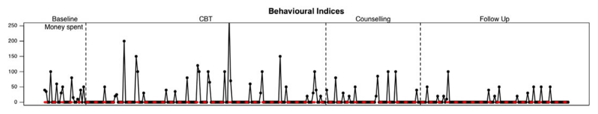

---
#  Assessing nomothetic outcomes 

+ Supplement the idiographic findings by evaluating whether pre/post phase scores on nomothetic measures meet criteria for reliable and clinical significant change (Jacobson & Traux , 1991)
+ Has the client shown reliable change (RC) -  a reduction in scores that exceeds a change that could be due to measurement error
	+ Use the reliability (Cronbach’s Alpha) of the measure and non-clinical and clinical. norms to calculate the amount of change that would be considered reliable
+ Has the client shown clinically significant change (CSC) – moved from above to below a clinical cut-off threshold
	+ Can use defined clinical cut-off’s if available for the measure or can use clinical and non-clinical norms to calculate a threshold.
	+ Bear in mind that process or generalisation measures may not make conceptual sense to assess clinically significant change (e.g. activation or quality of life).

.footnote[An Excel workbook & manual is provided in the Resource Pack that will allow you to do this!]

---
#  Evaluating nomothetic outcomes using reliable & clinically significant change 

+ Nomothetic measure of general distress: CORE-OM
	+ Connell et al (2007) paper reports psychometric evaluation including;
		+ Reliability of the measures (Cronbach’s Alpha = 0.91)
		+ Clinical and non-clinical norms (mean & SD)
		+ Established reliable change and clinical cut-off thresholds
	+ Pre-post change >= 6 shows Reliable Change
	+ Pre-post score moving from above to below 10 shows Clinically Significant Change
.pull-left[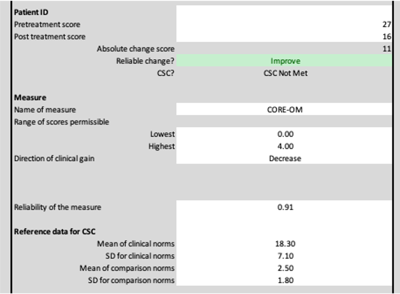]

.pull-right[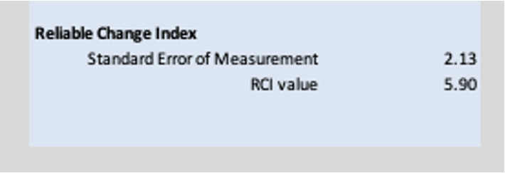]

---
#  What do you need to include in your assignment? 

VISUAL ANALYSIS
+ Visual plots of every idiographic measure
	+ Include phase trend lines and baseline median line
SUMMARY DESCRIPTIVES
+ Report means & SDs for each idiographic measure in each phase
STATISTICAL ANALYSIS
+ Assess for baseline trend (appropriate Tau correction if trend is present)
	+ Report at least 3 non-overlap statistics
	+ Assess autocorrelation in data (instructions provided in resources)
NOMOTHETIC OUTCOMES
+ Calculate whether RC and CSC have occurred for the primary nomothetic measure (main symptom or distress measure – CORE-OM?).
	+ For the other nomothetic measures calculate RC and if relevant, calculate CSC.

---
#  Deciding what software to use 

+ Data input and management: Excel
	+ Lots of the analysis can be done by hand (if you want)
	+ More sophisticated techniques require software/web calculators (they will also do the simpler analyses/visualisation as well!)
	+ See SingleCaseSoftware table for summary of some of the available programs/web calculators for SCED analysis
		+ What you can do in each program
		+ Benefits and limitations of each program
		+ Complexity to learn

---
#  Quick intro to SCED software 

+ Microsoft Excel
	+ Tau online calculator: http://ktarlow.com/stats/tau/
	+ Jepusto Shiny app: https://jepusto.shinyapps.io/SCD-effect-sizes/
	+ SCDA Shiny app: https://tamalkd.shinyapps.io/scda/
	+ Overlap Shiny app: https://manolov.shinyapps.io/Overlap/
[http://ktarlow.com/stats/tau/](https://jepusto.shinyapps.io/SCD-effect-sizes/)
[https://jepusto.shinyapps.io/SCD-effect-sizes/](http://ktarlow.com/stats/tau/)
[https://tamalkd.shinyapps.io/scda/](https://manolov.shinyapps.io/Overlap/)
[https://manolov.shinyapps.io/Overlap/](https://tamalkd.shinyapps.io/scda/)

---

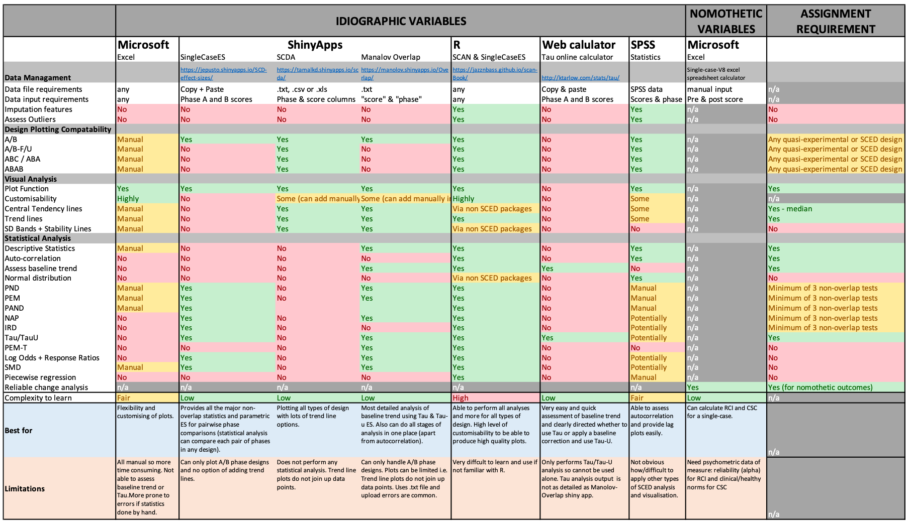

---
#  SCED Resource Pack 

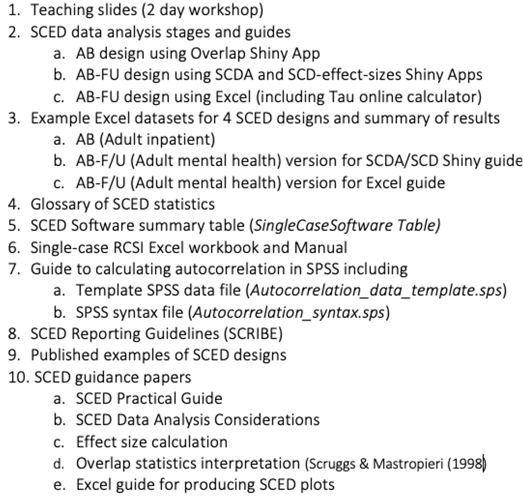

---
#  Practical task – have a go at SCED analysis 

+ We will divide you into groups of 4
+ Two example datasets – each group will be assigned a dataset
	+ Adult mental health setting (AB-F/U)
	+ Adult inpatient setting (AB)
+ Each has a guide to walk you through conducting and reporting the analysis in different types of software
+ There are multiple idiographic measures – you don’t have to do all of them in the practical – the examples are provided so you have a guide for the full analysis process you will need to do for your assignment
	+ You may want to divide the measures up between your group

---
#  Feedback your findings 

+ Feedback–informal overview of findings (~5-10 mins per group)
+ Things to report on;
  + Visual plot of each idiographic measure
	+ Assess whether there is a baseline trend using Tau/Tau-U
	+ Calculate x3 non-overlap statistics (Tau/Tau-U counts as one!)
	+ Descriptive statistics for each phase (means and SDs)
	+ RCSI analysis of nomothetic outcomes
PowerPoint template provided to copy and paste your results into!
+ Don’t worry too much about having a detailed interpretation!
	+ This is about getting you to practice having a go so we can troubleshoot any problems now and a way of showing the different resources and what they are able to do
	+ Plus each dataset has a summary of the results so you can sense check if you have produced the same findings – just don’t cheat!

---
#  Feedback 

+ How did you find using the different SCED software?
	+ Any problems?
	+ Any questions/queries?
	+ Anything you are concerned/unsure about?

---
name: last-slide
#  References 

+ Cohen et al (2013) Single-Case Research Design in Pediatric Psychology: Considerations Regarding Data Analysis. Journal of Pediatric Psychology, 39, 124-127.
	+ Krasny-Pacini & Evans (2018) Single-case experimental designs to assess intervention effectiveness in rehabilitation: A practical guide. Annals of Physical and Rehabilitation Medicine, 61, 164–179
