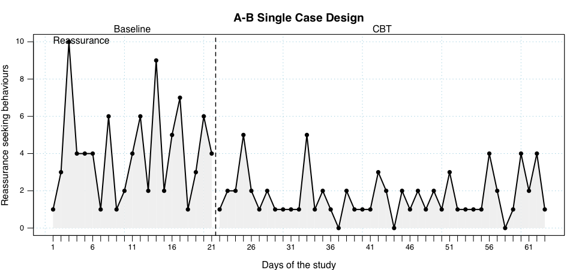
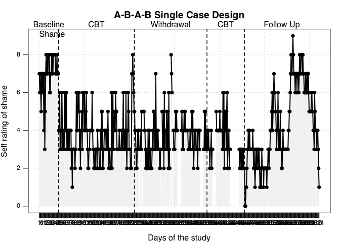

```{r setup, include=FALSE}
options(htmltools.dir.version = FALSE)

library(xaringan)
library(xaringanExtra)
library(dplyr)
library(gganimate)
library(ggExtra)
library(xaringanthemer)
library(RColorBrewer)
library(vembedr)

xaringanExtra::use_editable()
xaringanExtra::use_panelset()
xaringanExtra::use_freezeframe()
xaringanExtra::use_webcam()
xaringanExtra::use_fit_screen()
xaringanExtra::use_progress_bar(color = "red", location = "top")
xaringanExtra::use_tile_view()
xaringanExtra::use_scribble()
#xaringanExtra::use_search(show_icon = T, auto_search = F, position = "")
xaringanExtra::use_logo(image_url = "https://raw.githubusercontent.com/rstudio/hex-stickers/master/PNG/xaringan.png")

```
class: center, middle, split-three, about-me-slide
background-image: url(uos.png), url(pearls.jpg)
background-position:5% 95%, 98% 96%
background-size: 110px 50px, 10%

.column.bg-main1[.content[


### Steve Kellett

#### Clinical Psychologist

.fade[Sheffied Health & Social Care
NHS Foundation Trust]

[`r icons::icon_style(icons::fontawesome("envelope"), scale = 1.5)`](mailto:s.kellett@sheffield.ac.uk)
[`r icons::icon_style(icons::fontawesome("researchgate"), scale = 1.5)`](https://www.researchgate.net/profile/Stephen-Kellett)
]]
.column.bg-main2[.content[


### Mel Simmonds-Buckley

#### Researcher

.fade[University of Sheffield]

[`r icons::icon_style(icons::fontawesome("envelope"), scale = 1.5)`](mailto:m.simmonds-buckley@sheffield.ac.uk)
[`r icons::icon_style(icons::fontawesome("graduation-cap"), scale = 1.5)`](https://scholar.google.com/citations?user=T85W7TYAAAAJ&hl=en)
[`r icons::icon_style(icons::fontawesome("researchgate"), scale = 1.5)`](https://www.researchgate.net/profile/Mel-Simmonds-Buckley)
]]
.column.bg-main3[.content[


### Chris Gaskell

#### Clinical Psychologist

.fade[Salford Royal
NHS Foundation Trust]

[`r icons::icon_style(icons::fontawesome("twitter"), scale = 1.5)` ](https://twitter.com/chrisgaskell92)
[`r icons::icon_style(icons::fontawesome("github"), scale = 1.5)`](https://github.com/chris-gaskell)
[`r icons::icon_style(icons::fontawesome("envelope"), scale = 1.5)`](mailto:cgaskell1@sheffield.ac.uk)
[`r icons::icon_style(icons::fontawesome("graduation-cap"), scale = 1.5)`](https://scholar.google.com/citations?user=gQuNwfYAAAAJ&hl=en&authuser=1&oi=ao)
[`r icons::icon_style(icons::fontawesome("researchgate"), scale = 1.5)`](https://www.researchgate.net/profile/Chris-Gaskell-2)
]]

---
class: center, top, split-three, inverse
background-image: url(https://rin.org.uk/resource/resmgr/nav21/nav21_map.png)
background-position:8% 70%
background-size: 375px 300px


.column.bg-main1[.content[.right[


# `r icons::icon_style(icons::fontawesome("compass"), scale = 1, fill = "var(--my-yellow)")` Navigating these slides

]]]

--

.column.bg-main2[.content[


.Large[.bold[
### Day 1
[Aims + Intro](#aims-slide)

[Why](#why-slide)

[Measures](#measures-slide)

[Designs](#designs-slide)

[Setting it up](#stages-slide)]
]]]

--

.column.bg-main3[.content[


.Large[.Bold[
### Day 2

.bold[
[Analysis](#analysis-slide)

[Practice](#practice-slide)

[Resources](#resources-slide)]

]]]]

--

.footnote[.Large[**Note**: all underlined
.white[.underline[white]] and
.my-hot-white[.my-blue[.underline[blue]]] text are hyperlinks!]
]

---

name: contents-slide
class: inverse
background-image:
background-position:
background-size:

# `r icons::icon_style(icons::fontawesome("compass"), scale = 1, fill = "var(--my-yellow)")` Navigating these slides

`r icons::icon_style(icons::fontawesome("keyboard"), scale = 1, fill = "var(--my-yellow)")`
.large[.white[Keyoard shortcuts] - Press 'h'.]

`r icons::icon_style(icons::fontawesome("map-marked-alt"), scale = 1, fill = "var(--my-yellow)")`
.large[.white[Overview slides] - Press 'o'.]

`r icons::icon_style(icons::fontawesome("pen"), scale = 1, fill = "var(--my-yellow)")`
.large[.white[Scribble on slides] - Press 's'.]

.footnote[
.Large[`r icons::icon_style(icons::fontawesome("file-pdf"), scale = 1, fill = "var(--my-yellow)")`]
This presentation is also available as a <a href="https://chris-gaskell.github.io/uos-sced/output/index.pdf">pdf</a>.


.Large[`r icons::icon_style(icons::fontawesome("envelope"), scale = 1, fill = "var(--my-yellow)")`]
If you find any problems with these slides then e-mail
<a href="mailto:cgaskell1@sheffield.ac.uk">Chris</a>.
]

--
.pull-right[
.center[
<figure>
  
  
    
  <figcaption>.small[Slides made using Xaringan and R Markdown.]</figcaption>
</figure>

]]


---
layout: true
background-image: url(uos.png), url(pearls.jpg)
background-position:5% 95%, 98% 96%
background-size: 110px 50px, 10%
---
name: aims-slide

#  Aims of the workshop

+ Become .blue[familiar] with the requirements of the SCED.
+ Appreciate links between .blue[practice-based evidence] and SCED methodology.
+ To .blue[understand] the basic features of the available designs.
+ To consider ways of engaging clients in SCED.
+ To appreciate the .blue[potential] of SCED methodology.


---
#  Aims of the workshop

+ .blue[Review the application] of SCED methodology within clinical research and practice.
+ Consider potential .blue[practical difficulties] in implementation of SCED.
+ Provide .blue[practical experience] of design and analysis.
+ Foresee potential difficulties and .blue[trouble-shoot].

---
#  Hopes for the workshop

## Include `r icons::icon_style(icons::fontawesome("pen"), scale = 0.8, fill = "grey")`
.can-edit.key-firstSlideTitleunique[
- Write 
- Here
- And
- We
- Will
- Come
- Back
]

---
#  A note on the assignment

.pull-left[
+ Conduct a SCED of psychological treatment.
+ Any design is permissible (we will teach you all the methods). 
+ Submit via Unidrive (not Turnitin).
+ Ethical approval for this in place
+ Patient information & consent forms on MUSE (for your appendix).
]


.pull-right[
]

---
layout: false
class: inverse, middle, center
# Introduction to SCED

---
layout: true
name:aims-slide
background-image: url(uos.png), url(pearls.jpg)
background-position:5% 95%, 98% 96%
background-size: 110px 50px, 10%

---
# Brief history slide

---
background-image: url(images/plot.png)
background-position:50% 95%
background-size: 70% 30%

#  Single case involves: 

--

+ .blue[Time-series] measurement (quantifiable + over time).

--

+ .blue[Baseline] period.

--

+ .blue[Experimental manipulation] of an IV.

???

+ (i.e., introduce/remove/change treatment).
+ Experimental = 3+ manipulations
+ Less than this = quasi experimental.

--

+ Focus on .blue[within-subject] variability.

---

#  What is a baseline? 

+ .blue[Repeated measurements] before treatment is introduced.

???

so that the ‘natural course’ of the outcome is known.

--

+ The ideal is .blue[long and stable] baselines.

--

.pull-left[
.red[However:]
+ Not common 
+ Some disorders have inbuilt variability.
+ Are neutral baselines are a fallacy?
]

???
- so don’t always expect a stable baseline
- you have contact with the service user; you are assessing them.
--

.pull-right[

]

---

#  The focus? 

+ Your .blue[individual] service user.
+ .blue[You], the clinician.
+ Why and what leads to change in this client?
+ Within client change rather than across client change.

---
name: why-slide
class: inverse, middle, center
layout: false

# Why use SCEDs? 


---
layout: true
background-image: url(uos.png), url(pearls.jpg)
background-position:5% 95%, 98% 96%
background-size: 110px 50px, 10%
---

#  So why use SCEDs? 

--

.large[.red[`r icons::icon_style(icons::fontawesome("microscope"), scale = 1, fill = "var(--my-blue)")` **Clinical research:**] Testing clinical hypotheses and contributing to knowledge.]

--

.large[.blue[`r icons::icon_style(icons::fontawesome("vial"), scale = 1, fill = "var(--my-blue)")` **Practice philosophy**:] Being a scientist practitioner.]

--

.large[.orange[`r icons::icon_style(icons::fontawesome("balance-scale"), scale = 1, fill = "var(--my-blue)")` **Accountability and evaluation:**] Being a effective practitioner and auditing your work.]

--

.large[.pink[`r icons::icon_style(icons::fontawesome("book-open"), scale = 1, fill = "var(--my-blue)")` **Education and training:**] Learning SCED skills for the rest of your career]

---
# Status of SCED as a research tool? 

.pull-left-narrow[

]

.pull-right-wide[
+ Highly .blue[accessible] for clinicians.
+ Growing .blue[popularity].
  + Single case texts/books regularly published.
  + No longer restricted to ABA.
  + Health user movements.
+ Appropriate for novel or .blue[emerging] areas.
  + e.g. CBT and panic/psychosis rooted in SCED evidence.
  + RCTs are not the only option.
+ Rapidly developing field.
  + New analytical methods + designs.]


---
background-image: url(https://johnlewis.scene7.com/is/image/JohnLewis/237518072)
background-position: -20% 30%
background-size: 600px 600px

.pull-right-wide[
# Hour Glass Model

Three stage research cycle for evidencing treatment (Salkovskis, 1995):
1. Practice based pilot studies on small *n* in routine services.
2. Highly controlled trials efficacy studies (e.g. RCTs).
3. Implementation studies (return treatment to routine settings.)

.center[

<figcaption class="caption">Figure taken from interesting
<a href="https://bpspsychub.onlinelibrary.wiley.com/doi/pdfdirect/10.1111/papt.12278">BABCP article</a>
</figcaption>

]

]


---
background-image: url(https://www.its.ws/PublishingImages/Quality/Quality-data.jpg)
background-position:100% 65%
background-size: 45% 65%
#  Clinical Practice

.pull-left[
+ Accountability and evaluation.
+ Demonstrating treatment effectiveness.
+ Monitoring progress (or deterioration).
+ Training in single case methods makes more effective practitioners?
+ Referral on following ineffective treatment – you will really know this.
+ Inviting patient to be part of evaluation.
]

---
background-image: url(https://images.unsplash.com/photo-1588600878108-578307a3cc9d?ixid=MnwxMjA3fDB8MHxzZWFyY2h8MTR8fHJlc2VhcmNofGVufDB8fDB8fA%3D%3D&ixlib=rb-1.2.1&auto=format&fit=crop&w=500&q=60)
background-position:85% 85%
background-size: cover
class: center, bottom

##  .my-yellow[.my-hot-blue[Being a Scientific Practitioner]]

---

# Scientific Practitioner

.left[
Most useful contribution of SCED?

Ability to answer questions that are .red[clinically relevant variants on those of evidence-based practice.]]

--

.pull-left[
<figure class="quote">
  <blockquote>
  .blue[
  .large[
    “Does this evidence-based treatment work for this particular client, who differs in some way from the sample characteristics of the evidence base?".]]
  <figcaption>
</figure>
]

--

.pull-right[
]


---
#  What’s the advantage of SCED? 

.pull-left[
+ Low cost
+ Low infrastructure
+ Small ‘turning circle’
+ Easily adaptable + flexible
+ Collaborative (if done right)
]
--

.pull-right[
.Large[.white[.my-hot-blue[**Available for all clinicians to use!**]]].

.center[
]
]

---
#  Why don’t clinicians use it? 

+ Lack of confidence
+ Lack of knowledge
+ Can be messy in practice.
  + The ideal described in the classic texts on the design seems a far cry from what is possible in the real world.
+ Perception that it is too much for the recipient to handle.
  + <a href="http://www.dgapractice.com/documents/meehl_case_conferences_adapted.pdf">Theory of Spun Glass</a> (Meehl, 1973)

---
name: measures-slide
class: center, middle
background-image: url(https://images.unsplash.com/photo-1501516069922-a9982bd6f3bd?ixid=MnwxMjA3fDB8MHxzZWFyY2h8MXx8bWVhc3VyZXxlbnwwfHwwfHw%3D&ixlib=rb-1.2.1&auto=format&fit=crop&w=500&q=60)
background-position:85% 85%
background-size: cover


#  .my-yellow[.my-hot-blue[Approaches to Measurement]]


---
class: center, top, split-three,


.column.bg-main1[.content[


### Nomothetic Measures

.fade[Traditional questionnaire approaches used in services.]
]

.my-hot-pink[ 
- Attempts to generalise people.
- Uses objective knowledge.
- Based on data that is categorical or numerical.
]
]

--

.column.bg-main2[.content[


### Idiographic Measures

.fade[Unique measures applied in an individualised manner.]
]
.my-hot-green[
- Focuses on recognition of uniqueness.
- Uses subjective experience.
- Based on study of uniqueness at an individual level.
]
]

--

.column.bg-main3[.content[


### Qualitative Approaches

.fade[Qualitative approaches to assessment (e.g. interviews).]]
.my-hot-red[
- like ideographics, focuses on subjective judgement and experience. 
- Traditional methods: interviews, focus groups, soft outcomes.
]
]

.footnote[.center[
<a href="https://i.ytimg.com/vi/eiCSJL5zOng/maxresdefault.jpg">Adapted from </a>
]]
---

#  Ideographic or nomothetic?

<p>SCED seeks to balance focus on nomothetic and idiographic approaches to measurement.</p>

A funnel approach from nomothetic to idiographic target measures

--

<figure class="quote">
  <blockquote>.blue[
    “Different but complementary approaches to accumulating a broader base of evidence... So, when asked by clinical trainees, what two outcome measures I would recommend, my response invariably is: one nomothetic and one idiographic".]
  <figcaption>
    &mdash; Barkham, 2016</cite>  </figcaption>
</figure>

--

<p>Nomothetic and ideographic has long tradition within psychotherapy Sheffield University (e.g., Barkham, Stiles, & Shapiro, 1993).</p>

.footnote[
<a href="https://eprints.whiterose.ac.uk/104190/1/Commentary%20on%20Alves%20and%20Sales%20final%20version.pdf"> Barkham commentary (2017) </a>
]


---

https://dclinpsych.leeds.ac.uk/wp-content/uploads/sites/26/2019/03/Gary-Latchford-idiographic-day.pdf

#  Time series measurement 

+ .blue[Frequent and systematic measurement] of outcome measures that are key to the maintenance of the clinical problem
+ In essence, you then ask to what extent the observed variation in the measures is consistent with change occurring?
+ The repeated measures provide data on the variation across time in these outcome. With this information the search can begin for the causes of that variation


.center[

]
---
#  Using nomothetic measures  

+ These are the questionnaires that are 'off the shelf' and often used for pre-post change.
+ Use them:
  + at the start/end of each phase.
  + at the end of follow-up (if you have that in your design).
+ Try to match one the nomothetic measure to the presenting problem
+ Is the measure you are using one of .blue[Effectiveness]
  + General psychological distress (e.g. CORE-OM, SCL-90, BSI, OQ-45, K-10).
  + Disorder specific (e.g. BDI, PHQ-9, GAD-7, YBOCS, IES).
  + Functioning (e.g. WSAS).
+ Supplement with other measures?
  + Process?
  + Assimiliation?
  + Quality of life?
  + Clinician rated?
  
---

#  Choosing a generalisation measure   

+ Whilst the intervention should influence the target of the intervention, an important issue is whether the intervention generalises to other aspects of the client’s life.
	+ These measures are good test of the external validity of your work.
	+ You take these measures (e.g. quality of life) occasionally and often in tandem with the nomothetic outcomes measures.

---

# Qualitative approaches

+ Qualitative approaches can also be profitably applied to the single-case design. The collection of rich, detailed qualitative information throughout the course of treatment can prove useful in helping to rule out alternative hypotheses

---
background-image: url(https://i.imgflip.com/n7kko.jpg)
background-position:95% 65%
background-size: contain
class: inverse

# .my-hot-blue[Setting up ideographic measures]

---

#  Designing idiographic measures: tips  

### What to measure?
- Anything! (anything that matters).
- Design it collaboratively (ask your patient).
- From the start of the first appointment keep your eyes peeled.
- What does the patient, the family, the referrer want?
- Miracle Question...?
- Dont be afraid to offer suggestions or recommendations.

### Types of measure?
+ Could be a cognition, behaviour, affect or interpersonal process.
+ Anchored and scaled effectively – let the client define this.
+ Intensity measures; Frequency measures; Duration measures;

---
#  Designing idiographic measures: tips  

#### When to measure?
+ Daily? More than?

#### Who measures?
+ Can be anyone (doesen't have to be just one person).
+ Patient? Relative? Carer? Staff team?

#### Recording proceadures?
+ Write it down for them?
+ Diary? Excel sheet? Phone 'notes'? Microsoft Forms?

---
#  Baseline requirements

What is a suitable number of measurements (observations) for a baseline?

Some argue that there should be stability (5% variability around mean) before progressing to intervention .red[(Sidman ???)] however this is not always essential (or realistic).

When does the baseline end? (should be at a defined, planned point). A good place may be when providing the formulation (if using one).

**Remember**! Your ideiographic measures go from the start to end of the work.

---
#  Are baseline trends an issue? 

+ A worsening baseline (worsening of symptoms) may represent a temporary change that would dissipate regardless of any intervention.
+ An improving baseline may prevent confidence in saying whether subsequent improvement is due to intervention or natrual remission.
+ Stability also shows its not spontaneous recovery

.blue[Ideally] the baseline should be stable (mean level) with low variability.
Problems arise if baselines display:
( i )	Linear trends:
(ii)	Higher order trends
(iii)	High variability.
Presence of these makes visual or statistical analysis more difficult **(but still possible)**.

---
# Control idiographic measure 

+ These are an idiographic measure, not expected to change due to the intervention
+ If there is change in the target idiographic measures and not the control is shows the intervention working.

---
#  How to engage clients 

+ Not a must do aspect of your work
+ Good rationale
+ Have a relaxed attitude
+ Display interest in their plight
+ Be flexible
+ This is an aspect of your normal practice
+ Encourage reflectivity
+ Keeping an eye on progress
+ Promise feedback

---
layout: false
class: inverse

#  Modelling and role play  

+ Lets decide as a group what the client will be presenting with and in what context

+ What the demonstration and then we can critique it

+ Then you will get to practice in 2s – you both have a go.

---
name: designs-slide
class: inverse, middle, center

# Designs

---
layout: false
class: inverse

.panelset[

.panel[.panel-name[Designs] <!--Front-->

.small[.pull-left-narrow[.white[Numerous SCED designs]
- A = Baseline
- B = Intervention
- A2/W = Withdrawal
- C = Alt. treatment
- FU = Follow up

Important to consider ethics and feasibility.

Design influences strength of validity.
]]

.pull-right-wide[
### .center[Different types of SCED]
]
] 

.panel[.panel-name[A-B] <!--AB-->

.small[
.pull-left-narrow[
- Most basic & accessible.
- Improvement on simple pre-post
- Low validity.
- Quasi-experimental.
- Leaves open many alternative explanations for observed change.
]]

.pull-right-wide[
### .center[Classic A-B Design]

.center[
]
]

.right[
.small[For examples of studies using AB designs see
<a href="https://www.cambridge.org/core/services/aop-cambridge-core/content/view/F4ED9F2DD6363B66B0C18F6B4A3081B6/S1352465814000411a.pdf/transdiagnostic-cbt-treatment-of-co-morbid-anxiety-and-depression-in-an-older-adult-single-case-experimental-design.pdf">(Hague, 2015)</a> or 
<a href="https://eprints.whiterose.ac.uk/174906/3/Effectiveness%20of%20the%20unified%20protocol%20for%20treating%20co-morbid%20health%20anxiety%20and%20depression%20-%20an%20empirical%20case%20study.pdf">(Gaskell, 2021)</a>.
]]


]
<!--A-B-FU Design-->

.panel[.panel-name[A-B-FU]

.pull-left-narrow[
- Multiple comparisons possible.
- Can assess maintenance of gains.
- stronger than A-B design.
]

.pull-right-wide[
### .center[Integrating a follow-up]

.center[
]
]

.right[
.small[For an example study using an AB follow up design see
<a href="https://www.tandfonline.com/doi/pdf/10.1080/03069885.2021.1929834">(Kellett, 2021)</a>.
]]

] <!--A-B-FU Design-->

.panel[.panel-name[A-B-A-B]

.pull-left-narrow[
- Another point.
- Another point.
- Another point.
]

.pull-right-wide[
### .center[Using a withdrawal phase]

.center[
]
]

.right[
.small[For an example study using an ABAB design see
<a href="https://bpspsychub.onlinelibrary.wiley.com/doi/pdfdirect/10.1111/papt.12278">(Kellett, 2021)</a>.
]]

] <!--A-B-A-C-->

.panel[.panel-name[A-B-A-C]
.pull-left-narrow[
- Comparing treatment effectiveness.
– Seldom employed in psychotherapy .
]

.pull-right-wide[
### .center[Alternating the treatment]
.center[]]

.right[.small[For an example study using an ABC design see <a href="https://www.cambridge.org/core/services/aop-cambridge-core/content/view/2997836636C01A6766138701F889AB8C/S1352465820000521a.pdf/treatment_of_compulsive_buying_disorder_comparing_the_effectiveness_of_cognitive_behavioural_therapy_with_personcentred_experiential_counselling.pdf">(Kellett, 2021)</a>.]]
]
] <!--Panel-Set-End-->

---

# Withdrawl designs and Ethics

Ask - am I being ethical and so are reversals or withdrawals appropriate?
Important to know the methodological features before you start (see the later planning slide)

###  Problems with withdrawal designs  

Non-reversible treatments:
therapeutic instructions (e.g. self-control / management strategies)
CAP/client expectations/interactions;
long-acting pharmacological interventions;
altered environments;
altered staff attitudes.
Carry-over effects between the phases.
Ethical / clinical problems:
Prior agreement with client / staff needed,
Client consent and general ethical issues
Ethics of accountability and evaluation
Relatively brief withdrawal phase and rapid re-instatement of treatment
Problem of client's expectations and adherence to withdrawal
Treatment holidays?

---

#  Threats to validity

1.	History (extraneous concurrent events)
2.	Maturation (spontaneous recovery)
3.	Testing (reactivity and the mere measurement effect)
4.	Instrumentation (reliability)
5.	Multiple intervention problems (can a psychotherapy be withdrawn)?
6.	Instability

---

#  Mini interventions

+ Borkovec and Castonguay (2006) point out, the use of mini-interventions in which circumscribed components of treatment are actively manipulated is an underused research strategy, but one that offers the opportunity to increase our knowledge of basic change mechanisms in psychological treatments.
	+ Separate out the modules on the time series graphs and test for an effect.
	+ Submit the excel sheets as part of the submission showing each module and the scores on the idiographic measures during the phases

---
#  Planning your design

+what to consider; write a plan and take it to supervision  
+ The type of design
	+ The number of sessions in each phase and module
	+ How the phases will be sequenced with the modules
	+ Frequency of the idiographic measures
	+ Frequency of the nomothetic and generalisation measures
	+ Frequency, duration, place and time of sessions
	+ Baseline fidelity (be able to describe in full detail)
	+ Treatment fidelity (how to keep everything the same bar starting treatment).

---
name: stages-slide
class: inverse

#  STAGES TO SCED  

IDENTIFY QUESTION  AND HYPOTHESIS.
SELECT APPROPRIATE DESIGN AND MEASURES.
IDENTIFY MATERIALS  AND RESOURCES.
COLLECT DATA/  SUPERVISE  STUDY.
ANALYSIS.
INTERPRETATION.
COMMUNICATION.
These stages may need to be considered collectively and not in isolation.  For example. The level of communication of findings may determine the level of analysis adopted.

---
#  IDENTIFY CLINICAL QUESTIONS AND HYPOTHESES 

Have you a clear UP formulation in place?
Have you got the books!?
Is the treatment compatible with the therapy as described in the treatment manual?
State the hypotheses clearly!
State any therapeutic predictions clearly!

---
#  IDENTIFY MEASURES	 

What measures are required to assess therapeutic aims and goals?
Ensure measures are suitable for SCED. In practice this usually means observational measures such as time sampling and staff checklists on in-patient wards; daily diaries of symptoms, functioning, problem resolution; regular use of short psychometric questionnaires etc.
Ensure rating scales are unambiguously worded and are anchored and well described.

---

#  IDENTIFY MEASURES	 

Ensure that diaries are well laid out and well presented. Scraps of paper do not value people and are seldom completed!
Try to use a page a day to record ratings - avoid weekly sheets.
Consider using a combination of measures targeted at both symptoms and functioning .
Consider several sources of measurements: client and partner/carer, child and parent,
Consider adding a follow ups phase; A/B-FU design

---
#  MATERIALS AND RESOURCES 

Ensure measures are acceptable/appropriate for client, or staff or carer or partner.
Plan for study to fit into clinical practice: baseline collected across sessions 1-2, intervention starts session 3, 16 sessions of therapy contracted, follow ups at 6 weeks and 6 months?
Ensure adequate resources - staff properly briefed, supervisor aware of coursework (especially to them), new staff on wards are briefed.

---
#  MATERIALS AND RESOURCES 

If staff are collecting the data do they understand the design rationale and do they need any training?
Data is being recorded and stored reliably (i.e. it is being written down in a retrievable manner, it is not missing and is confidential).
If appropriate, staff should receive ongoing feedback about progress of the case (i.e. regular review meetings) and this be reported in the method.
What are the consequences of diverting resources to this project in relation to other ongoing clinical work? Is it feasible in the setting your working in?

---
#  INTERPRETATION	 

What are the main changes or effects?
How do they correspond to predictions?
Are they valid given the design?
What alternative explanations (i.e. threats to validity) are there?
Are the effects reliable or clinical significant? Are they noticeable to therapist, client or others?
Are they generalizable or clinically replicable?
If effects are clinically nonsignificant - what explanations exist?

---
#  COMMUNICATION  AND DISSEMINATION 

Share the findings with the client or the staff or both.
Thank client and staff.

---
class: inverse

# Course work specific information

---


##  What can you submit?  

+ The design of the submission needs to either be quasi-experimental or a SCED.  The design of quasi-single case experiments is A/B .
	+ It is advantageous but not necessary to have a follow-up phase (i.e. an A/B-FU design) in which the idiographic measures continue to be collected and the nomothetic measure(s) are collected at the final follow-up.
	+ CAPs are also encouraged to consider completing a true SCED in which a cross-over design is used (e.g. A/B/C where B is the UP and C is CAT) or where there is a treatment removal component (i.e. ABA, or ABAB ).
	+ All designs need to be agreed in clinical supervision, and treatment withdrawal particularly considered due to the associated ethical issues.

---
#  How to do a good piece of coursework 

The structure is (4,000 words):
Title
Introduction, aims and hypotheses
Methods
Results
Discussion
References
Appendices (not in the word count)

---
#  Reporting standards for SCED  

+ Look in the resource pack and its there! (SCRIBE guidelines)
	+ This will help you write inclusively.
	+ Read this before planning a case too!

---
#  What goes in the introduction?  

+ Concise summary of relevant background literature about the UP and how it relates to the case.
	+ Consider and refer to relevant NICE guidance if available.
	+ Provide focus of present case study briefly mentioning rationale and approach and end with specification of hypotheses according to design.

---
#  How to write the methods  

+ Outline of rationale and design of SCED, brief and confidential description of client ( presenting problem/diagnosis/previous service usage/current medication ), service, supervision, and your details.
	+ Describe the idiographic measures and the data collection methods (e.g. observational schedules, self-monitoring diaries completed by the client ) and the analysis strategy being used and naming the package being used.
	+ List and provide evidence of the psychometric properties of nomothetic measures used and the analysis strategy being taken (e.g. RCSC).
	+ A three-column treatment adherence table should be provided detailing the session number, UP module, clinical content of that session.
	+ Report any competency checks done by your supervisor.

---


```{r tbl54, echo = FALSE}
tbl54 <- tibble::tribble(
~`Session`, ~`Phase of study and module`, ~`Content`,
"Session 1","A: Baseline","Assessment of current functioning",
"Session 2","A: Baseline ","Assessment of developmental history and formulation produced",
"Session 3","B: Module 1; motivation enhancement","Balance sheet and goals",
"Session 4","B: Module 2; understanding emotions","Completed 3 system analysis and agreed homework",
"Sessions 5 and 6","B: Module 3;  emotion awareness","Completed and analysed two ARCs and agreed homework"
)

kableExtra::kable_styling(knitr::kable(tbl54), font_size = 18)
```

---
#  What goes in the results?  

+ Present the idiographic results first in the form of time series graphs for each measure that show each of the phases of the study. Days not sessions on the horizontal axis and scores on the vertical axis.
	+ A baseline median trend line should be fitted and also trend lines fitted for each phase. 
	+ Baseline phases should be assessed for trend using both visual analysis and statistical analysis (e.g. Tau).  When significant baseline trend arises, statistical analyses which adjust for baseline trend should be employed (e.g. Tau-U).  Individual study phases should also be assessed for serial dependency (autocorrelation).
	+ Present a table of means (SD) for each idiographic measure for each phase of the study.

---
#  What goes in the results?  

+ Idiographic outcome measures should be assessed for between phase change using a minimum of three nonoverlap tests (e.g. PND, PEM, PAND, NAP, IRD).  These findings should be reported in a table and interpreted using the established guidelines. 
	+ The scores on nomothetic measure(s) should be presented in a table for each time point.
	+ This table also contains reliable and clinical change analysis and also the relevant clinical and community norms on that measure.
	+ If there is a sessional nomothetic outcome measure then that should be graphed at each session.

---
#  What goes in the results?  

+ Additional or supplementary data and graphs can be appended to the report after the reference section.
	+ When statistical analyses are reported, ensure sufficient details ( t values, d.f . , means and SDs of groups, etc.) for their interpretation are provided.
+ Graphs within the body of the text should be of a high standard of presentation and clearly labelled.

---
#  What goes in the discussion?   

+ The findings should be discussed in relation to the original hypotheses.
	+ Please ensure that you relate the results obtained to the design employed.
	+ Consider the generalisability of the intervention effect.
	+ A critical review of the methods, design and analysis employed should be presented.
	+ Please comment on any relevant organisational and ethical issues surrounding this clinical study.  The clinical significance of the study should also be addressed.

---
#  What goes in the appendices?   

+ UP formulation
	+ Examples of the idiographic data collection tools (e.g. observational schedules by staff or patient daily diaries) should be placed in the appendices and care should be taken to ensure that they are anonymous.  Redact personal information.
	+ As the UP is a modularised approach, the CAP trainees should also submit an excel sheet in which the idiographic measures are clearly labelled in terms of dates of completion by the service user and the progression through the UP modules.
	+ The signed consent form

---
#  CONCLUSIONS 

SCED can be used in a wide variety of situations and these range across service users and settings.
CAPs as a scientist-practitioners – a good place to be.
Integrate the methods into your practice – don’t be anxious.
Always start with the baseline -  the design can evolve and be flexible
Remember to reme m ber your client -  your job is to help then and not manipulate variables and phases
Play around with the methodology

---
#  How to analyse and interpret SCED data? 


---
#  Recap from Day 1 

+ Introduced rationale and applications of SCED
	+ Aware of different types of SCED design
	+ How to design and implement measures

---
#  Treatment  

+ Involves introducing (/or withdrawing) an intervention and monitoring change in outcome.
+ The treatment you deliver needs to be well specified
	+ Take all of this – the design and the intervention to supervision.
	+ Tape a treatment session and get your supervisor to rate your clinical competency with the CTS-R and you can report that in your method – that would add to the write up (but isn’t a must do).


```{r output, include=F, echo=F}
#xaringanBuilder::build_pdf("index.Rmd",
 #        complex_slides = T, partial_slides = F)
```


