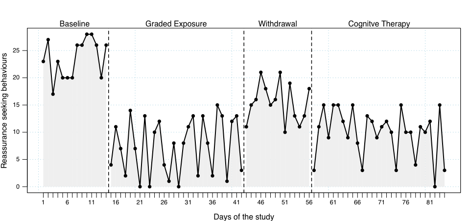
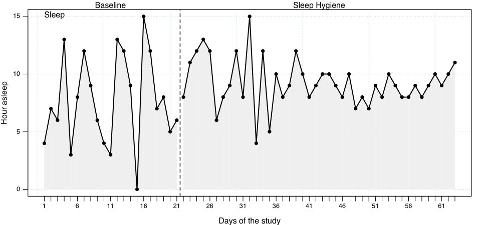
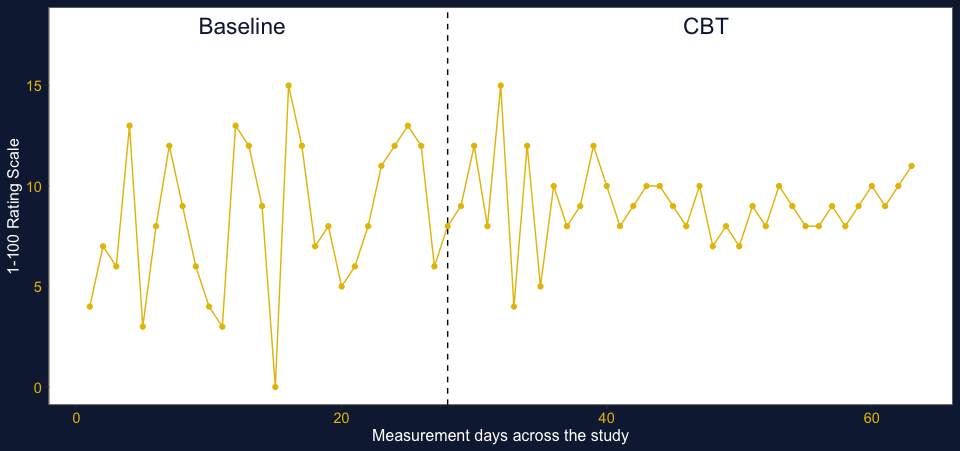

<!-- -->

<!-- -->

<!-- -->

<!-- -->

<!-- -->


```r
Plot <- ggplot(dat$dat.stability, aes(x = mt, y = values)) +
          geom_line(aes(color = phase), color="#e5bf00", fill = "red") +
          scale_color_manual(values = c("#e5bf00"))+
          jtools::theme_apa()+
          ylab("1-100 Rating Scale")+
          xlab("Measurement days across the study") +
          # ggtitle("Time series graph - alternative treatment for major depression") +
  geom_vline(xintercept = 28, color = "black", size=.5, linetype="dashed")+
     annotate("text", x = .5*(0+25), y = 18, label = "Baseline", size=6, colour = "#122140") +
     annotate("text", x = .5*(25+70), y = 18, label = "CBT", size=6, colour = "#122140")
```

```
## Warning: Ignoring unknown parameters: fill
```

```r
Plot <- Plot + theme(
            plot.background = element_rect(fill = "#122140", colour = NULL, size = 0),
            panel.background =  element_rect(fill = "white", colour = "white"),
            text = element_text(colour = "white"),
            axis.text = element_text(colour = "#e5bf00", size = rel(1))
            )

Plot <- Plot + geom_point(colour = "#e5bf00")

Plot
```

<!-- -->
